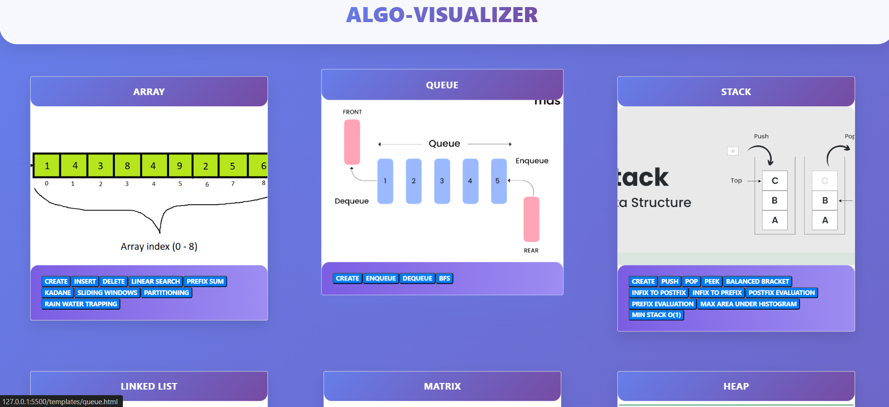
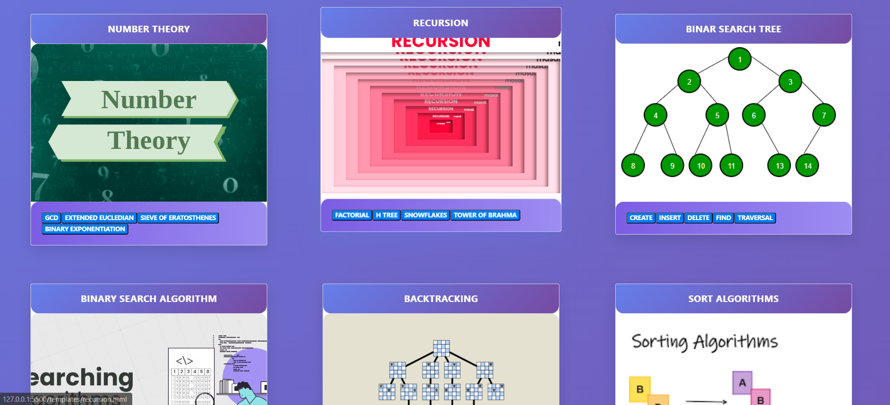
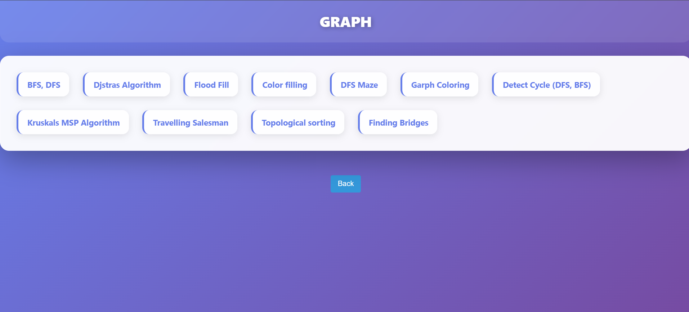

🧠 Algo Visualizer

An interactive algorithm visualization web app that helps students and developers understand how popular algorithms work — visually and intuitively.
It covers a wide range of Data Structures and Algorithms, including Arrays, Sorting, Graphs, Queues, Recursion, and more.

---

[**Check out the live demo!**](https://algo-visualizer-sandy.vercel.app/)

---

## 🖼️ Screenshots

### Home Page


### Alternate Home Page


### Graph Visualization


⚙️Features

✅ Visualizes sorting, searching, graph traversal, number theory, and more

✅ Interactive buttons and animations for each algorithm

✅ Time and space complexity charts

✅ Modular structure — each algorithm has its own HTML file

✅ Built with HTML, CSS, and JavaScript (no frameworks)

✅ Beginner-friendly, educational design

## ⚙️ Data Structures and Algorithms Implemented

A comprehensive collection of **Data Structures**, **Algorithms**, and **Visualization Modules** implemented in this project.

---

### ⚙️ DATA STRUCTURES
- Disjoint Set  
- String  
- Linked List  
- Graph  
- Stack  
- Heap  
- Array  
- Queue  
- Hashing Table  
- Matrix  
- Binary Search Tree  

---

### 🔢 ARRAY ALGORITHMS
- Rain Water Trapping  
- Binary Search  
- Sliding Window  
- Prefix Sum  
- Array Partitioning  
- Linear Search  
- Kadane’s Algorithm  
- Linear Search *(Duplicate kept for completeness)*  

---

### 🧱 STACK ALGORITHMS
- Prefix Evaluation  
- Infix to Prefix  
- Balanced Bracket  
- Min Stack O(1)  
- Infix to Postfix  
- Maximum Area Under Histogram  
- Postfix Evaluation  

---

### 🧮 MATRIX ALGORITHMS
- Kadane’s 2D  
- Sorted Matrix Search  
- Transpose  
- Sparse Matrix  

---

### 🧭 QUEUE ALGORITHMS
- Breadth First Search (BFS)
- Queue ADT

---

### ⛰️ HEAP ALGORITHMS
- Heap Sort  
- Heapify  

---

### 🔗 LINKED LIST ALGORITHMS
- Queue Using Linked List  
- Circular Linked List  
- Stack Using Linked List  
- Circular Doubly Linked List  
- Doubly Linked List  
- Singly Linked List  

---

### 🌳 BINARY SEARCH TREE ALGORITHMS
- BST Implementation  
- Traversal (Inorder, Preorder, Postorder)  

---

### 🕸️ GRAPH ALGORITHMS
- DFS Maze  
- Cycle Detection (BFS / DFS)  
- Depth First Search (DFS)  
- Flood Fill  
- Graph Coloring  
- Breadth First Search (BFS)  
- Travelling Salesman  
- Kruskal’s Algorithm  
- Bridges  
- Color Filling  
- Topological Sort  

---

### ⚡ SORTING ALGORITHMS
- Counting Sort  
- Bubble Sort  
- Merge Sort  
- Quick Sort  
- Selection Sort  
- Heap Sort  
- Shell Sort  
- Insertion Sort  

---

### 🔍 BINARY SEARCH ALGORITHMS
- Find Peak Element  
- Bitonic Array Search  
- Binary Search  
- Minimum Page Allocation  
- Start Point of Rotated Array  

---

### 🌀 RECURSION ALGORITHMS
- H Tree Animation  
- Factorial  
- Tower of Hanoi  
- Snowflakes Animation  

---

### ♟️ BACKTRACKING ALGORITHMS
- Maze Generator  
- Knight’s Tour  
- Graph Coloring  
- N-Queen Problem  
- Sudoku Solver  

---

### ⚔️ DIVIDE AND CONQUER PARADIGM
- Counting Inversions  
- Quick Sort  
- Merge Sort  

---

### 💰 GREEDY PARADIGM
- Huffman Coding  
- Kruskal’s Algorithm  
- Fractional Knapsack  
- Counting Money  
- Job Scheduling  

---

### 🧠 DYNAMIC PROGRAMMING PARADIGM
- Subset Sum  
- Travelling Salesman  
- 0/1 Knapsack  
- Cutting Rod  
- Longest Common Subsequence  
- Unbounded Knapsack  
- Coin Change  
- Ladders Problem  
- Levenshtein Distance  

---

### ✨ STRING ALGORITHMS
- Robin Karp  
- Naive Matching  
- KMP  
- Z Algorithm  
- Boyer Moore  

---

### 🔗 DISJOINT SET ALGORITHMS
- Union  
- Find  

---

### 🧩 HASHING TABLE ALGORITHMS
- Quadratic Probing  
- Linear Probing  
- Double Hashing  
- Closed Hashing  
- Open Hashing  

---

### ⏱️ TIME COMPLEXITY
- Big Theta (θ)  
- Big Omega (Ω)  
- Big Oh (O)  

---

### 🔢 NUMBER THEORY
- Binary Exponentiation  
- Extended Euclidean Algorithm  
- Sieve of Eratosthenes  
- GCD (Euclidean)


1️⃣ Clone the Repository
```bash
git clone https://github.com/Priyesh-Jain24/Algo-Visualizer.git
```

2️⃣ Navigate to the Project Folder
```bash
cd Algo-Visualizer
```

3️⃣ Open in Browser

You can simply open index.html directly in a browser,
or run a local server using VS Code Live Server extensi


